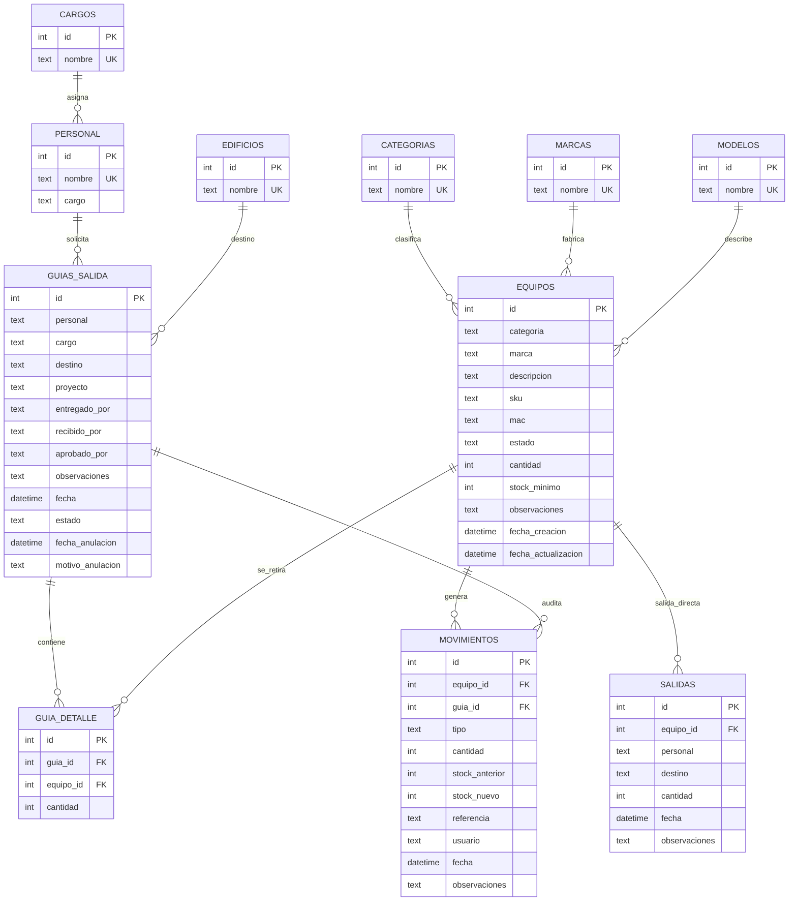

# Modelo Entidad Relacion - Inventario CCTV y Redes - Fase 1 Corporativa

## Objetivo
Este modelo ordena el sistema para que la guia de salida no sea solo un documento, sino una operacion trazable. Cada ingreso, salida, edicion, anulacion o reintegro debe quedar registrado en `movimientos`.

## Diagrama ER recomendado para Fase 1

## Regla principal de integridad

La tabla `equipos` guarda el stock actual. La tabla `movimientos` guarda la historia. Nunca se debe modificar stock sin registrar un movimiento.

## Flujo de stock para guias

1. Crear guia activa:
   - Valida producto existente.
   - Valida cantidad mayor a cero.
   - Valida stock suficiente.
   - Descuenta stock.
   - Inserta detalle en `guia_detalle`.
   - Registra `SALIDA_GUIA` en `movimientos`.

2. Editar guia activa:
   - Compara detalle anterior contra detalle nuevo.
   - Si aumenta cantidad, descuenta solo la diferencia.
   - Si reduce cantidad, reintegra solo la diferencia.
   - Si elimina un producto, reintegra todo lo anterior.
   - Registra `SALIDA_GUIA` o `DEVOLUCION_GUIA` segun corresponda.

3. Anular guia:
   - No borra la guia.
   - Cambia estado a `ANULADA`.
   - Reintegra todos los productos.
   - Registra `DEVOLUCION_GUIA`.
   - Evita doble reintegro si la guia ya estaba anulada.

## Nota corporativa
Actualmente el sistema conserva algunos catalogos como texto en tablas operativas para no romper tu aplicacion actual. En una Fase 2 de arquitectura se recomienda migrar esos campos a IDs reales:

- `equipos.categoria_id`
- `equipos.marca_id`
- `equipos.modelo_id`
- `personal.cargo_id`
- `guias_salida.personal_id`
- `guias_salida.destino_id`

La version entregada ahora agrega validacion de catalogos desde backend y trazabilidad sin obligarte a rehacer todo el sistema.
